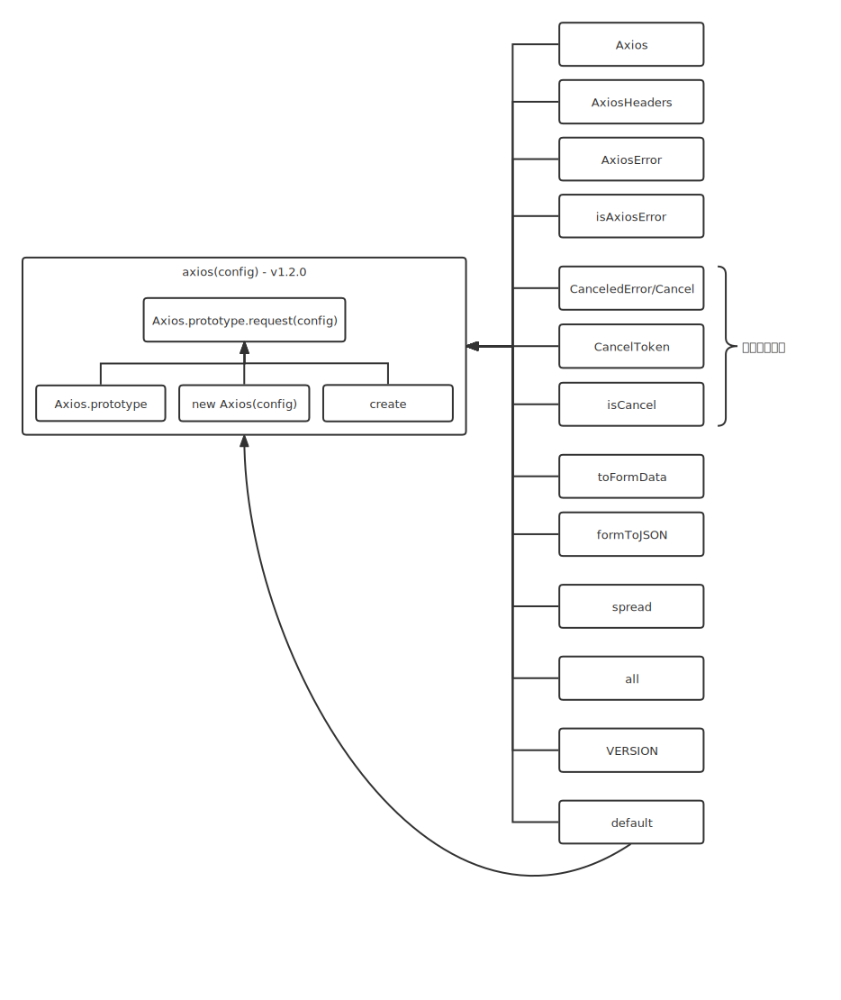

# axios 源码解析

基于 `v1.2.0` 版本进行分析.



## 1. 目录结构

```markdown
- lib/
  - adapters/ 适配器相关.
    - adapters.js // 提供获取适配器的方法，并返回适配器集合对象.
    - http.js // node 环境使用内置的 http 模块.
    - xhr.js // 浏览器环境使用 XMLHttpRequest 对象.
  - cancel/ 取消请求相关.
    - CanceledError.js // 成功取消请求时调用此构造函数.
    - CancelToken.js // 取消请求类.
    - isCancel.js // 判断请求是否已经取消.
  - core/ 核心相关.
    - Axios.js // 核心类.
    - AxiosError.js // 错误构造函数.
    - AxiosHeaders.js // 头类.
    - buildFullPath.js // 将两段 URL 组合在一起返回.
    - dispatchRequest.js // 使用传入的配置对象和选定的适配器发送请求.
    - InterceptorManager.js // 拦截器管理器类.
    - mergeConfig.js // 合并配置对象.
    - settle.js
    - transformData.js
  - defaults/ 默认配置相关.
    - index.js // 默认配置对象.
    - transitional.js // .
  - env/
    - classes/FormData.js
    - data.js
  - helpers/
    - AxiosTransformStream.js
    - AxiosURLSearchParams.js
    - bind.js // 返回一个包装函数，改变传入函数的上下文绑定.
    - buildURL.js
    - combineURLs.js // 拼接两段 url 为一个.
    - cookies.js
    - deprecatedMethod.js
    - formDataToJSON.js
    - fromDataURI.js
    - isAbsoluteURL.js
    - isAxiosError.js
    - isURLSameOrigin.js
    - null.js // 仅返回一个 null，目前未被使用.
    - parseHeaders.js // 将 XMLHttpRequest.getAllResponseHeaders() 返回的 headers 字符串解析为 headers 对象.
    - parseProtocol.js // 从请求的 URL 中解析出协议名称.
    - speedometer.js
    - spread.js
    - throttle.js
    - toFormData.js
    - toURLEncodedForm.js
    - validator.js
  - platform/ // 针对不同平台环境提供不同的环境属性.
    - browser/ // 浏览器环境需要的属性.
      - classes/
        - FormData.js
        - URLSearchParams.js
      - index.js
    - node/ // nodejs 环境需要的属性.
      - classes/
        - FormData.js
        - URLSearchParams.js
      - index.js 
  - axios.js // 入口文件，返回 axios 函数（即绑定 Axios 实例上下文的 Axios.prototype.request 方法的包装函数），并在 axios 上挂载若干属性.
  - utils.js // 通用工具、类型判断等函数.
```

## 2. 默认导出函数 axios

文件位置：`lib/axios.js`

### 2.1 创建 axios 函数

```javascript
/**
 * 创建 axios 函数.
 * 
 * @param {Object} defaultConfig - 配置对象.
 * 
 * @returns {Function} axios 函数.
 */
function createInstance(defaultConfig) {
  // 创建一个 Axios 实例备用.
  const context = new Axios(defaultConfig);
  
  // axios 函数即绑定了 Axios 实例上下文的 Axios.prototype.request 函数.
  const instance = bind(Axios.prototype.request, context);

  // 将 Axios 的实例方法扩展到 axios 函数上.
  utils.extend(instance, Axios.prototype, context, { allOwnKeys: true });

  // 将 Axios 的实例属性扩展到 axios 函数上.
  utils.extend(instance, context, null, { allOwnKeys: true });

  // 创建新实例的工厂方法，用于创建互不影响的 axios 函数.
  instance.create = function create(instanceConfig) {
    return createInstance(mergeConfig(defaultConfig, instanceConfig));
  };
  
  // 返回 axios 函数.
  return instance;
}

// 创建默认导出的函数.
const axios = createInstance(defaults);
```

### 2.2 给 axios 函数挂载属性.

```javascript
// 挂载 Axios 类用于继承.
axios.Axios = Axios;

// 挂载取消请求的相关属性.
axios.CanceledError = CanceledError;
axios.CancelToken = CancelToken;
axios.isCancel = isCancel;

// 挂载版本号.
axios.VERSION = VERSION;

// 挂载对象转换为 FormData 对象的方法.
axios.toFormData = toFormData;

// 挂载错误类.
axios.AxiosError = AxiosError;

// 给 CanceledError 属性添加一个 Cancel 别名，以便向后兼容.
axios.Cancel = axios.CanceledError;

// 挂载 Promise.all 语法.
axios.all = function all(promises) {
  return Promise.all(promises);
};

// 挂载 spread 方法，该方法可将索要执行的函数与所需参数数组分开.
axios.spread = spread;

// 挂载 AxiosError 实例判断方法.
axios.isAxiosError = isAxiosError;

// 挂载头类.
axios.AxiosHeaders = AxiosHeaders;

// 挂载 FormData 对象转换为对象的方法.
axios.formToJSON = thing => formDataToJSON(utils.isHTMLForm(thing) ? new FormData(thing) : thing);

// 挂载 axios 函数本身.
axios.default = axios;
```

## 3. 核心类 Axios

文件位置：`lib/core/Axios.js`

### 3.1 构造器

```javascript
constructor(instanceConfig) {
  // 初始化默认配置对象.
  this.defaults = instanceConfig;
  
  // 初始化拦截器对象.
  this.interceptors = {
    request: new InterceptorManager(),
    response: new InterceptorManager(),
  };
}
```

### 3.2 核心方法 Axios.prototype.request

```javascript
/**
 * 发送请求.
 *
 * @param {String|Object} configOrUrl - URL字段或者配置对象.
 * @param {Object} [config] - 配置对象.
 *
 * @returns {Promise} 经拦截器处理过的 Promise 函数.
 */
request(configOrUrl, config) {
  /* --- 参数处理 start --- */
  // 判断 configOrUrl 的类型，若为字符串类型，则认为是 url，赋值 config 的 url 字段.
  // 否则就认为是配置对象，整体替换给 config.
  if (typeof configOrUrl === 'string') {
    config = config || {};
    config.url = configOrUrl;
  } else {
    config = configOrUrl || {};
  }

  // 合并默认配置和传入的配置（如有重名属性，则传入的覆盖默认的）.
  config = mergeConfig(this.defaults, config);
  /* --- 参数处理 end --- */

  const { transitional, paramsSerializer, headers } = config;

  /* --- start --- */
  if (transitional !== undefined) {
    validator.assertOptions(transitional, {
      silentJSONParsing: validators.transitional(validators.boolean),
      forcedJSONParsing: validators.transitional(validators.boolean),
      clarifyTimeoutError: validators.transitional(validators.boolean),
    }, false);
  }

  if (paramsSerializer !== undefined) {
    validator.assertOptions(paramsSerializer, {
      encode: validators.function,
      serialize: validators.function,
    }, true);
  }
  /* --- end --- */

  // 优化方法字段: 若不合法则使用默认方法，若默认的也不合法则使用 get 字段; 且转换为小写.
  config.method = (config.method || this.defaults.method || 'get').toLowerCase();

  /* --- headers处理 start --- */
  let contextHeaders;

  // 设置扁平的 headers.
  contextHeaders = headers && utils.merge(
    headers.common,
    headers[config.method]
  );

  // 删除 headers 中的方法属性.
  contextHeaders && utils.forEach(
    ['delete', 'get', 'head', 'post', 'put', 'patch', 'common'],
    (method) => {
      delete headers[method];
    }
  );

  // 优化头部字段.
  config.headers = AxiosHeaders.concat(contextHeaders, headers);
  /* --- headers处理 end --- */

  /* --- 拦截器处理 start --- */
  // 请求拦截器数组.
  const requestInterceptorChain = [];

  // 判断是否为同步请求拦截器，后续调用会用到.
  let synchronousRequestInterceptors = true;

  this.interceptors.request.forEach(function unshiftRequestInterceptors(interceptor) {
    // 若请求拦截器具有 runWhen 属性函数，并且传入 config 的执行结果为 false，则跳过此请求拦截器直接判断处理下一个.
    if (typeof interceptor.runWhen === 'function' && interceptor.runWhen(config) === false) {
      return;
    }

    // 若有一个请求拦截器的 synchronous 属性为 false, 则 synchronousRequestInterceptors 即为 false.
    synchronousRequestInterceptors = synchronousRequestInterceptors && interceptor.synchronous;

    // 将请求拦截器的 fulfilled、rejected 回调函数依次存入 requestInterceptorChain 中.
    requestInterceptorChain.unshift(interceptor.fulfilled, interceptor.rejected);
  });

  // 响应拦截器数组.
  const responseInterceptorChain = [];
  this.interceptors.response.forEach(function pushResponseInterceptors(interceptor) {
    // 遍历响应拦截器堆栈，将每个响应拦截器的 fulfilled、rejected 回调函数依次存入 responseInterceptorChain 中.
    responseInterceptorChain.push(interceptor.fulfilled, interceptor.rejected);
  });
  /* --- 拦截器处理 end --- */

  let promise;
  let i = 0;
  let len;

  /* --- 含有异步请求拦截器的处理 start --- */
  if (!synchronousRequestInterceptors) {
    const chain = [dispatchRequest.bind(this), undefined];
    chain.unshift.apply(chain, requestInterceptorChain);
    chain.push.apply(chain, responseInterceptorChain);
    len = chain.length;

    promise = Promise.resolve(config);

    while (i < len) {
      promise = promise.then(chain[i++], chain[i++]);
    }

    return promise;
  }
  /* --- 含有异步请求拦截器的处理 end --- */

  /* --- 全同步请求拦截器的处理 start --- */
  len = requestInterceptorChain.length;

  let newConfig = config;

  i = 0;

  while (i < len) {
    const onFulfilled = requestInterceptorChain[i++];
    const onRejected = requestInterceptorChain[i++];
    try {
      newConfig = onFulfilled(newConfig);
    } catch (error) {
      onRejected.call(this, error);
      break;
    }
  }

  try {
    promise = dispatchRequest.call(this, newConfig);
  } catch (error) {
    return Promise.reject(error);
  }

  i = 0;
  len = responseInterceptorChain.length;

  while (i < len) {
    promise = promise.then(responseInterceptorChain[i++], responseInterceptorChain[i++]);
  }

  return promise;
  /* --- 全同步请求拦截器的处理 end --- */
}
```

### 3.3 10个支持的请求方法

```javascript
// 这 10 个别名方法只是整理了一下配置对象，最终调用的还是 Axios.prototype.request 方法.
utils.forEach(['delete', 'get', 'head', 'options'], function forEachMethodNoData(method) {
  /*eslint func-names:0*/
  Axios.prototype[method] = function(url, config) {
    return this.request(mergeConfig(config || {}, {
      method,
      url,
      data: (config || {}).data,
    }));
  };
});

utils.forEach(['post', 'put', 'patch'], function forEachMethodWithData(method) {
  function generateHTTPMethod(isForm) {
    return function httpMethod(url, data, config) {
      return this.request(mergeConfig(config || {}, {
        method,
        headers: isForm ? {
          'Content-Type': 'multipart/form-data'
        } : {},
        url,
        data,
      }));
    };
  }

  Axios.prototype[method] = generateHTTPMethod();

  Axios.prototype[method + 'Form'] = generateHTTPMethod(true);
});
```
如上述代码所示，目前支持的 10 个请求方法（delete、get、head、options、post、put、patch、postForm、putForm、patchForm）最终还是调用 Axios.prototype.request 方法，调用之前整合好配置对象.


## 调用流程


